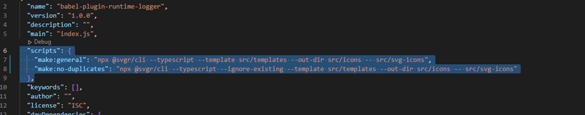

# Using GC3 Icons
Coming Soon

# Creating your own GC3 Icons
To create your own GC3 Icons, you will need to convert the SVG icons into components. Converting SVG icons to components will require you to use the Command Line to perform this action.

1. Clone this repository in your own machine.
2. Place the SVGs that you would like to convert into `src/svg-icons`. Make sure that the names of your SVG files are what you envision the component name to be.
3. Go to package.json.
4. Run script `make:general`. If you would like to only generate components for newly added SVG icons, run `make:no-duplicates` instead.

# TODO for Developer:
1. Make npm package
2. Reconfigure the output tsx file, making sure that the files are always generated into an output file that is used to create the various components
3. Add in a metatag JSON file such that the search bar will be working alongside with it and the component file
4. Configure prettier and eslint
